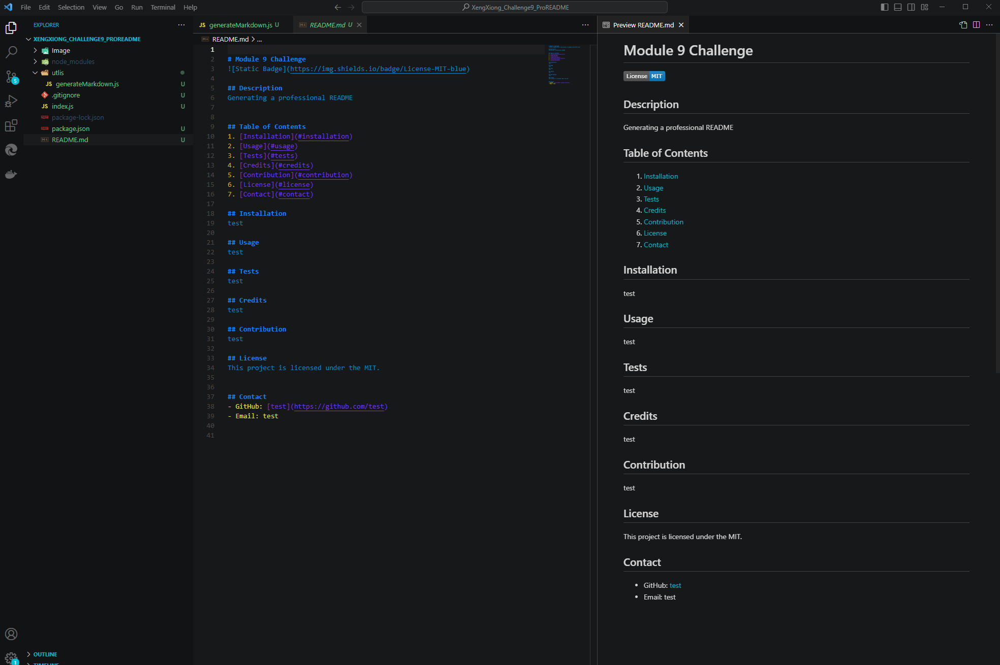

# Module 9 Chellenge Professional README.md
 

## Description
Generating a README.md

## Table of Contents
1. [Installation](#installation)
2. [Usage](#usage)
3. [Tests](#tests)
4. [Credits](#credits)
5. [Contribution](#contribution)
6. [License](#license)
7. [Contact](#contact)

## Installation
none

## Usage
none

## Tests
none

## Credits
none

## Contribution
none

## License
This project is licensed under the MIT.

## Contact
- GitHub: [freeway9527](https://github.com/freeway9527)
- Email: xiongxeng@gmail.com

